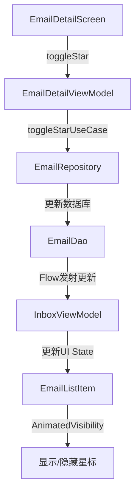

# 设计文档

## 概述

本设计文档描述了邮件列表卡片的视觉优化方案，重点解决已读/未读状态区分、收藏标志布局、状态同步和动画稳定性问题。设计遵循Material Design 3规范，确保视觉一致性和良好的用户体验。

## 架构

### 组件层次结构

```
EmailListItem (优化后)
├── Card (固定88dp高度)
│   └── Row (主容器)
│       ├── UnreadIndicator (条件显示)
│       ├── AvatarWithInitial (48dp)
│       ├── Spacer (12dp)
│       ├── Column (邮件内容 - weight(1f))
│       │   ├── Row (发件人行)
│       │   │   ├── Text (发件人名称)
│       │   │   └── Column (时间和星标)
│       │   │       ├── Text (时间戳)
│       │   │       └── AnimatedVisibility (星标图标)
│       │   ├── Text (主题)
│       │   └── Text (预览)
│       └── Spacer (8dp - 右侧边距)
```

### 状态管理流程



## 组件和接口

### 1. EmailListItem 组件优化

#### 接口定义

```kotlin
@Composable
fun EmailListItem(
    email: Email,
    isSelected: Boolean = false,
    animationIndex: Int = 0,
    isScrolling: Boolean = false,
    onItemClick: () -> Unit,
    onItemLongClick: () -> Unit = {},
    onStar: () -> Unit = {},
    onArchive: () -> Unit = {},
    onDelete: () -> Unit = {},
    modifier: Modifier = Modifier
)
```

#### 视觉设计规范

**卡片尺寸**
- 固定高度: 88dp
- 水平内边距: 16dp
- 垂直内边距: 4dp
- 卡片内部内边距: 12dp

**未读指示器**
- 宽度: 4dp
- 高度: 填充卡片高度
- 颜色: MaterialTheme.colorScheme.primary
- 位置: 卡片最左侧
- 圆角: 左侧2dp圆角

**头像**
- 尺寸: 48dp × 48dp
- 形状: 圆形
- 左侧间距: 未读时8dp（指示器后），已读时12dp

**文本样式**
- 发件人（未读）: bodyLarge + FontWeight.Bold
- 发件人（已读）: bodyLarge + FontWeight.Normal
- 主题（未读）: bodyMedium + FontWeight.SemiBold
- 主题（已读）: bodyMedium + FontWeight.Normal
- 预览: bodySmall + alpha 0.7f
- 时间戳: labelSmall

**星标图标**
- 尺寸: 16dp × 16dp
- 位置: 时间戳正下方，右对齐
- 颜色: MaterialTheme.colorScheme.primary
- 上边距: 2dp

### 2. UnreadIndicator 组件

新增组件，用于显示未读状态指示条。

```kotlin
@Composable
private fun UnreadIndicator(
    modifier: Modifier = Modifier
) {
    Box(
        modifier = modifier
            .width(4.dp)
            .fillMaxHeight()
            .background(
                color = MaterialTheme.colorScheme.primary,
                shape = RoundedCornerShape(
                    topStart = 2.dp,
                    bottomStart = 2.dp
                )
            )
    )
}
```

### 3. TimeAndStarColumn 组件

新增组件，垂直排列时间和星标图标。

```kotlin
@Composable
private fun TimeAndStarColumn(
    timestamp: Instant,
    isStarred: Boolean,
    modifier: Modifier = Modifier
) {
    Column(
        modifier = modifier,
        horizontalAlignment = Alignment.End,
        verticalArrangement = Arrangement.spacedBy(2.dp)
    ) {
        // 时间戳
        Text(
            text = formatTimestamp(timestamp),
            style = MaterialTheme.typography.labelSmall,
            color = MaterialTheme.colorScheme.onSurfaceVariant
        )
        
        // 星标图标（带动画）
        AnimatedVisibility(
            visible = isStarred,
            enter = fadeIn(
                animationSpec = tween(
                    durationMillis = FleurAnimation.FAST_DURATION,
                    easing = FleurAnimation.FastOutSlowIn
                )
            ) + scaleIn(
                animationSpec = tween(
                    durationMillis = FleurAnimation.FAST_DURATION,
                    easing = FleurAnimation.FastOutSlowIn
                ),
                initialScale = 0.8f
            ),
            exit = fadeOut(
                animationSpec = tween(
                    durationMillis = FleurAnimation.FAST_DURATION,
                    easing = FleurAnimation.AccelerateEasing
                )
            ) + scaleOut(
                animationSpec = tween(
                    durationMillis = FleurAnimation.FAST_DURATION,
                    easing = FleurAnimation.AccelerateEasing
                ),
                targetScale = 0.8f
            )
        ) {
            Icon(
                imageVector = Icons.Filled.Star,
                contentDescription = "已加星标",
                tint = MaterialTheme.colorScheme.primary,
                modifier = Modifier.size(16.dp)
            )
        }
    }
}
```

## 数据模型

### Email 模型（无需修改）

现有的Email模型已包含所需的所有字段：
- `isRead: Boolean` - 已读状态
- `isStarred: Boolean` - 星标状态
- `timestamp: Instant` - 时间戳

### UI State 更新

InboxViewModel的UI State已经支持邮件列表的响应式更新，无需修改。

## 错误处理

### 状态同步失败

**场景**: 用户在详情页标星，但网络请求失败

**处理策略**:
1. 使用离线操作管理器记录操作
2. 在UI上乐观更新（立即显示星标）
3. 后台重试失败的操作
4. 如果最终失败，显示错误提示并回滚UI

**实现**:
```kotlin
fun toggleStar(emailId: String) {
    viewModelScope.launch {
        // 乐观更新UI
        _uiState.update { state ->
            val updatedEmails = state.emails.map {
                if (it.id == emailId) it.copy(isStarred = !it.isStarred) else it
            }
            state.copy(emails = updatedEmails)
        }
        
        // 执行实际操作
        val result = toggleStarUseCase(emailId)
        result.onFailure { error ->
            // 回滚UI
            _uiState.update { state ->
                val revertedEmails = state.emails.map {
                    if (it.id == emailId) it.copy(isStarred = !it.isStarred) else it
                }
                state.copy(
                    emails = revertedEmails,
                    error = error as? FleurError
                )
            }
        }
    }
}
```

### 动画性能问题

**场景**: 在低端设备上动画卡顿

**处理策略**:
1. 使用`isScrolling`参数在滚动时禁用动画
2. 减少动画持续时间（200ms）
3. 使用硬件加速层

**实现**:
```kotlin
AnimatedVisibility(
    visible = isStarred && !isScrolling,
    // ... 动画配置
)
```

## 测试策略

### 单元测试

**EmailListItemTest.kt**
- 测试未读邮件显示蓝色指示条
- 测试已读邮件不显示指示条
- 测试星标图标显示/隐藏
- 测试字体粗细变化
- 测试卡片固定高度

**InboxViewModelTest.kt**
- 测试toggleStar更新UI状态
- 测试乐观更新和回滚逻辑
- 测试邮件列表去重

### UI测试

**EmailListItemUITest.kt**
- 测试点击卡片触发onItemClick
- 测试长按触发多选模式
- 测试星标动画播放
- 测试滚动时动画禁用

### 集成测试

**EmailSyncIntegrationTest.kt**
- 测试详情页标星后列表更新
- 测试离线标星后同步
- 测试多设备状态同步

### 视觉回归测试

使用Paparazzi或Screenshot Testing进行视觉回归测试：
- 未读邮件卡片截图
- 已读邮件卡片截图
- 已读+标星邮件卡片截图
- 未读+标星邮件卡片截图

## 性能优化

### 1. 列表渲染优化

**问题**: 大量邮件渲染导致滚动卡顿

**解决方案**:
- 使用`LazyColumn`的`key`参数确保稳定的item identity
- 在滚动时禁用动画（通过`isScrolling`参数）
- 使用`derivedStateOf`减少重组

```kotlin
val isScrolling by remember {
    derivedStateOf {
        listState.isScrollInProgress
    }
}
```

### 2. 动画性能优化

**问题**: 星标动画在低端设备上卡顿

**解决方案**:
- 使用`graphicsLayer`启用硬件加速
- 减少动画持续时间到200ms
- 使用简单的淡入淡出+缩放动画

```kotlin
Icon(
    // ...
    modifier = Modifier
        .size(16.dp)
        .graphicsLayer {
            // 启用硬件加速
        }
)
```

### 3. 状态更新优化

**问题**: 频繁的状态更新导致不必要的重组

**解决方案**:
- 使用`distinctUntilChanged`避免重复更新
- 使用`structuralEqualityPolicy`进行深度比较
- 只更新变化的邮件项

```kotlin
val emails by viewModel.uiState
    .map { it.emails }
    .distinctUntilChanged()
    .collectAsState(initial = emptyList())
```

## 可访问性

### 语义化标记

```kotlin
Card(
    modifier = modifier.semantics {
        // 邮件卡片语义
        contentDescription = buildString {
            append(if (email.isRead) "已读邮件" else "未读邮件")
            append("，来自 ${email.from.name ?: email.from.address}")
            append("，主题：${email.subject}")
            if (email.isStarred) {
                append("，已加星标")
            }
            append("，时间：${formatTimestamp(email.timestamp)}")
        }
        
        // 自定义操作
        customActions = listOf(
            CustomAccessibilityAction("标星") {
                onStar()
                true
            },
            CustomAccessibilityAction("归档") {
                onArchive()
                true
            },
            CustomAccessibilityAction("删除") {
                onDelete()
                true
            }
        )
    }
)
```

### 颜色对比度

- 未读指示条颜色: primary (确保与背景对比度 ≥ 3:1)
- 文本颜色: onSurface (对比度 ≥ 4.5:1)
- 星标图标: primary (对比度 ≥ 3:1)

### 触摸目标尺寸

- 卡片最小触摸目标: 88dp × 88dp (符合Material Design规范)
- 星标图标虽然只有16dp，但整个卡片都可点击

## 动画规范

### 星标图标动画

**进入动画**:
- 淡入: 0% → 100% 透明度
- 缩放: 80% → 100% 尺寸
- 持续时间: 200ms
- 缓动曲线: FastOutSlowIn

**退出动画**:
- 淡出: 100% → 0% 透明度
- 缩放: 100% → 80% 尺寸
- 持续时间: 200ms
- 缓动曲线: AccelerateEasing

### 已读状态变化动画

**未读指示条**:
- 淡入/淡出: 200ms
- 无缩放或位移，避免影响布局

**字体粗细变化**:
- 无动画，直接切换（避免文本抖动）

## 实现细节

### 布局约束

```kotlin
Card(
    modifier = modifier
        .fillMaxWidth()
        .height(88.dp) // 固定高度
        .padding(horizontal = 16.dp, vertical = 4.dp)
) {
    Row(
        modifier = Modifier
            .fillMaxSize()
            .padding(12.dp),
        verticalAlignment = Alignment.CenterVertically
    ) {
        // 未读指示器（条件显示）
        AnimatedVisibility(
            visible = !email.isRead,
            enter = fadeIn(tween(FleurAnimation.FAST_DURATION)),
            exit = fadeOut(tween(FleurAnimation.FAST_DURATION))
        ) {
            UnreadIndicator(
                modifier = Modifier.padding(end = 8.dp)
            )
        }
        
        // 头像
        AvatarWithInitial(
            name = email.from.name ?: email.from.address,
            modifier = Modifier.size(48.dp)
        )
        
        Spacer(modifier = Modifier.width(12.dp))
        
        // 邮件内容
        Column(
            modifier = Modifier.weight(1f),
            verticalArrangement = Arrangement.SpaceEvenly
        ) {
            // 第一行：发件人和时间+星标
            Row(
                modifier = Modifier.fillMaxWidth(),
                horizontalArrangement = Arrangement.SpaceBetween,
                verticalAlignment = Alignment.Top
            ) {
                Text(
                    text = email.from.name ?: email.from.address,
                    style = MaterialTheme.typography.bodyLarge.copy(
                        fontWeight = if (!email.isRead) FontWeight.Bold else FontWeight.Normal
                    ),
                    maxLines = 1,
                    overflow = TextOverflow.Ellipsis,
                    modifier = Modifier.weight(1f)
                )
                
                Spacer(modifier = Modifier.width(8.dp))
                
                TimeAndStarColumn(
                    timestamp = email.timestamp,
                    isStarred = email.isStarred && !isScrolling
                )
            }
            
            // 第二行：主题
            Text(
                text = email.subject.ifEmpty { "(无主题)" },
                style = MaterialTheme.typography.bodyMedium.copy(
                    fontWeight = if (!email.isRead) FontWeight.SemiBold else FontWeight.Normal
                ),
                maxLines = 1,
                overflow = TextOverflow.Ellipsis
            )
            
            // 第三行：预览
            Text(
                text = email.bodyPreview,
                style = MaterialTheme.typography.bodySmall,
                color = MaterialTheme.colorScheme.onSurfaceVariant.copy(alpha = 0.7f),
                maxLines = 1,
                overflow = TextOverflow.Ellipsis
            )
        }
        
        Spacer(modifier = Modifier.width(8.dp))
    }
}
```

### 状态同步机制

**数据流**:
1. 用户在EmailDetailScreen点击星标按钮
2. EmailDetailViewModel调用toggleStarUseCase
3. UseCase更新数据库（EmailDao）
4. EmailRepository的Flow发射新数据
5. InboxViewModel订阅Flow，更新UI State
6. EmailListItem重组，显示新的星标状态

**关键代码**:
```kotlin
// EmailRepository.kt
fun observeEmails(accountId: String?): Flow<List<Email>> {
    return if (accountId != null) {
        emailDao.observeEmailsByAccount(accountId)
    } else {
        emailDao.observeAllEmails()
    }.map { entities ->
        entities.map { entityMapper.toDomain(it) }
    }
}

// InboxViewModel.kt
init {
    viewModelScope.launch {
        emailRepository.observeEmails(null)
            .collect { emails ->
                _uiState.update { it.copy(emails = emails) }
            }
    }
}
```

## 设计决策

### 1. 为什么使用左侧指示条而不是背景色？

**原因**:
- 更符合Material Design 3的设计语言
- 不会影响卡片的整体视觉层次
- 更容易与选中状态区分
- 对比度更高，更易识别

### 2. 为什么将星标放在时间下方？

**原因**:
- 避免星标图标挤压时间戳
- 保持时间戳的固定位置
- 垂直排列更节省水平空间
- 视觉上更整洁

### 3. 为什么使用AnimatedVisibility而不是Crossfade？

**原因**:
- AnimatedVisibility性能更好
- 不需要保留隐藏元素的布局空间
- 动画更自然（淡入淡出+缩放）
- 更符合Material Design动画规范

### 4. 为什么在滚动时禁用动画？

**原因**:
- 提升滚动性能
- 避免大量动画同时播放
- 减少GPU负载
- 在低端设备上保持流畅

## 兼容性考虑

### Android版本
- 最低支持: Android 8.0 (API 26)
- 目标版本: Android 14 (API 34)
- Material 3组件兼容性: 完全支持

### 设备类型
- 手机: 完全支持
- 平板: 完全支持（卡片宽度自适应）
- 折叠屏: 支持（响应式布局）

### 主题
- 浅色主题: 完全支持
- 深色主题: 完全支持
- 动态颜色: 支持（Android 12+）

## 后续优化方向

1. **手势操作**: 支持左右滑动快速标星/归档
2. **批量操作**: 支持多选模式下批量标星
3. **自定义主题**: 允许用户自定义未读指示条颜色
4. **智能分组**: 按发件人或主题自动分组显示
5. **预加载优化**: 预加载可见区域外的邮件内容
