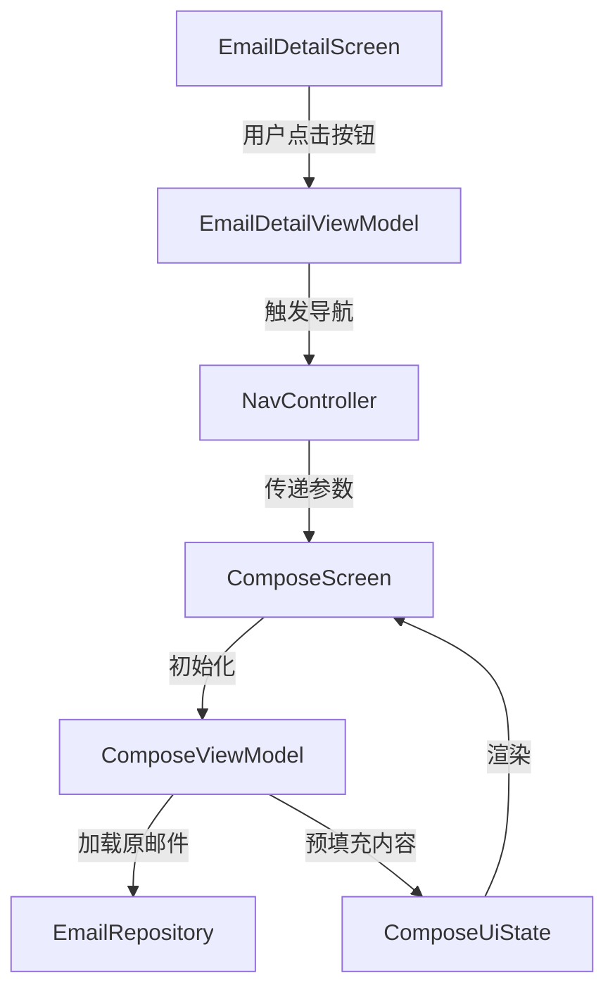

# Design Document

## Overview

本设计文档描述了如何实现邮件详情页面中回复、转发和全部回复功能的完整解决方案。当前问题是 `EmailDetailViewModel` 中的 `reply()`、`replyAll()` 和 `forward()` 方法只有 TODO 注释而没有实际实现，导致用户点击按钮后没有任何响应。

本设计将实现以下功能：
1. 在 `EmailDetailViewModel` 中实现导航逻辑
2. 扩展 `ComposeViewModel` 以支持回复和转发模式
3. 在 `ComposeScreen` 中实现分离式 UI 布局：回复输入区域和原邮件展示区域独立显示
4. 实现邮件内容的格式化和合并逻辑

## Architecture

### 组件关系图



### 数据流

1. **用户操作** → 用户在 `EmailDetailScreen` 点击回复/转发按钮
2. **ViewModel 处理** → `EmailDetailViewModel` 调用导航回调，传递邮件 ID 和操作类型
3. **导航** → `NavController` 导航到 `ComposeScreen`，携带参数
4. **初始化** → `ComposeViewModel` 从 `SavedStateHandle` 获取参数
5. **加载数据** → `ComposeViewModel` 从 `EmailRepository` 加载原邮件
6. **预填充** → 根据操作类型预填充收件人、主题、正文
7. **渲染** → `ComposeScreen` 显示预填充的内容

## Components and Interfaces

### 1. EmailDetailViewModel 修改

**职责**：触发导航到撰写页面，传递必要的参数

**修改内容**：
```kotlin
class EmailDetailViewModel @Inject constructor(
    // ... 现有依赖
) : ViewModel() {
    
    // 添加导航回调
    private var onNavigateToCompose: ((emailId: String, mode: ComposeMode) -> Unit)? = null
    
    fun setNavigationCallback(callback: (emailId: String, mode: ComposeMode) -> Unit) {
        onNavigateToCompose = callback
    }
    
    /**
     * 回复邮件
     */
    fun reply() {
        val email = _uiState.value.email ?: return
        onNavigateToCompose?.invoke(email.id, ComposeMode.REPLY)
    }
    
    /**
     * 全部回复
     */
    fun replyAll() {
        val email = _uiState.value.email ?: return
        onNavigateToCompose?.invoke(email.id, ComposeMode.REPLY_ALL)
    }
    
    /**
     * 转发邮件
     */
    fun forward() {
        val email = _uiState.value.email ?: return
        onNavigateToCompose?.invoke(email.id, ComposeMode.FORWARD)
    }
}
```

### 2. ComposeMode 枚举

**职责**：定义撰写模式

**新增文件**：`ComposeMode.kt`
```kotlin
enum class ComposeMode {
    NEW,        // 新邮件
    REPLY,      // 回复
    REPLY_ALL,  // 全部回复
    FORWARD,    // 转发
    DRAFT       // 草稿
}
```

### 3. Screen 路由修改

**职责**：支持传递撰写模式参数

**修改内容**：
```kotlin
object Compose : Screen("compose?mode={mode}&referenceId={referenceId}") {
    fun createRoute(
        mode: ComposeMode = ComposeMode.NEW,
        referenceId: String? = null
    ): String {
        val params = mutableListOf<String>()
        if (mode != ComposeMode.NEW) {
            params.add("mode=${mode.name}")
        }
        referenceId?.let { params.add("referenceId=$it") }
        return if (params.isEmpty()) "compose" else "compose?${params.joinToString("&")}"
    }
    
    fun createReplyRoute(emailId: String) = 
        createRoute(ComposeMode.REPLY, emailId)
    
    fun createReplyAllRoute(emailId: String) = 
        createRoute(ComposeMode.REPLY_ALL, emailId)
    
    fun createForwardRoute(emailId: String) = 
        createRoute(ComposeMode.FORWARD, emailId)
}
```

### 4. ComposeViewModel 扩展

**职责**：根据模式加载和预填充邮件内容

**修改内容**：
```kotlin
@HiltViewModel
class ComposeViewModel @Inject constructor(
    savedStateHandle: SavedStateHandle,
    private val sendEmailUseCase: SendEmailUseCase,
    private val accountRepository: AccountRepository,
    private val emailRepository: EmailRepository  // 新增依赖
) : ViewModel() {
    
    private val composeMode: ComposeMode
    private val referenceEmailId: String?
    
    init {
        // 从 SavedStateHandle 获取参数
        val modeString = savedStateHandle.get<String>("mode")
        composeMode = modeString?.let { 
            ComposeMode.valueOf(it) 
        } ?: ComposeMode.NEW
        
        referenceEmailId = savedStateHandle.get<String>("referenceId")
        
        loadDefaultAccount()
        
        // 如果是回复或转发，加载原邮件并预填充
        if (referenceEmailId != null) {
            loadReferenceEmail(referenceEmailId)
        }
        
        startAutoSave()
    }
    
    /**
     * 加载原邮件并预填充内容
     */
    private fun loadReferenceEmail(emailId: String) {
        viewModelScope.launch {
            _uiState.update { it.copy(isLoading = true) }
            
            emailRepository.getEmailById(emailId)
                .catch { e ->
                    _uiState.update {
                        it.copy(
                            isLoading = false,
                            error = FleurError.UnknownError(e.message ?: "加载失败", e)
                        )
                    }
                }
                .collect { result ->
                    result.fold(
                        onSuccess = { email ->
                            prefillContent(email)
                            _uiState.update { it.copy(isLoading = false) }
                        },
                        onFailure = { error ->
                            _uiState.update {
                                it.copy(
                                    isLoading = false,
                                    error = error as? FleurError
                                        ?: FleurError.UnknownError(error.message ?: "加载失败")
                                )
                            }
                        }
                    )
                }
        }
    }
    
    /**
     * 根据模式预填充内容
     */
    private fun prefillContent(referenceEmail: Email) {
        when (composeMode) {
            ComposeMode.REPLY -> prefillReply(referenceEmail)
            ComposeMode.REPLY_ALL -> prefillReplyAll(referenceEmail)
            ComposeMode.FORWARD -> prefillForward(referenceEmail)
            else -> {}
        }
    }
    
    /**
     * 预填充回复内容
     */
    private fun prefillReply(referenceEmail: Email) {
        val currentAccount = _uiState.value.selectedAccount
        
        _uiState.update {
            it.copy(
                toAddresses = referenceEmail.from.formatted(),
                subject = addReplyPrefix(referenceEmail.subject),
                body = "",  // 回复内容为空，由用户输入
                originalEmail = referenceEmail,  // 保存原邮件用于显示
                isDirty = false  // 预填充不算修改
            )
        }
    }
    
    /**
     * 预填充全部回复内容
     */
    private fun prefillReplyAll(referenceEmail: Email) {
        val currentAccount = _uiState.value.selectedAccount
        val currentEmail = currentAccount?.email ?: ""
        
        // 收件人：原发件人 + 原收件人（排除自己）
        val toAddresses = buildList {
            add(referenceEmail.from)
            addAll(referenceEmail.to.filter { it.address != currentEmail })
        }.distinct().joinToString(", ") { it.formatted() }
        
        // 抄送：原抄送人（排除自己）
        val ccAddresses = referenceEmail.cc
            .filter { it.address != currentEmail }
            .distinct()
            .joinToString(", ") { it.formatted() }
        
        _uiState.update {
            it.copy(
                toAddresses = toAddresses,
                ccAddresses = ccAddresses,
                showCcBcc = ccAddresses.isNotEmpty(),
                subject = addReplyPrefix(referenceEmail.subject),
                body = "",  // 回复内容为空，由用户输入
                originalEmail = referenceEmail,  // 保存原邮件用于显示
                isDirty = false
            )
        }
    }
    
    /**
     * 预填充转发内容
     */
    private fun prefillForward(referenceEmail: Email) {
        _uiState.update {
            it.copy(
                subject = addForwardPrefix(referenceEmail.subject),
                body = buildForwardBody(referenceEmail),
                originalEmail = referenceEmail,  // 保存原邮件用于显示
                // 转发时保留原附件引用
                attachments = referenceEmail.attachments,
                isDirty = false
            )
        }
    }
    
    /**
     * 切换原邮件展开/折叠状态
     */
    fun toggleOriginalEmailExpanded() {
        _uiState.update {
            it.copy(isOriginalEmailExpanded = !it.isOriginalEmailExpanded)
        }
    }
    
    // ... 其他现有方法
}
```

### 5. 邮件内容格式化工具

**职责**：格式化回复和转发的邮件内容，在发送时合并用户输入和原邮件

**新增文件**：`EmailContentFormatter.kt`
```kotlin
object EmailContentFormatter {
    
    /**
     * 添加回复前缀
     */
    fun addReplyPrefix(subject: String): String {
        return if (subject.startsWith("Re:", ignoreCase = true)) {
            subject
        } else {
            "Re: $subject"
        }
    }
    
    /**
     * 添加转发前缀
     */
    fun addForwardPrefix(subject: String): String {
        return if (subject.startsWith("Fwd:", ignoreCase = true)) {
            subject
        } else {
            "Fwd: $subject"
        }
    }
    
    /**
     * 合并回复内容和原邮件（发送时调用）
     */
    fun mergeReplyContent(replyText: String, originalEmail: Email): String {
        return buildString {
            // 用户的回复内容
            append(replyText)
            
            // 分隔线和原邮件
            appendLine()
            appendLine()
            appendLine("---------- 原始邮件 ----------")
            appendLine("发件人: ${originalEmail.from.formatted()}")
            appendLine("日期: ${formatTimestamp(originalEmail.timestamp)}")
            appendLine("收件人: ${originalEmail.to.joinToString(", ") { it.formatted() }}")
            if (originalEmail.cc.isNotEmpty()) {
                appendLine("抄送: ${originalEmail.cc.joinToString(", ") { it.formatted() }}")
            }
            appendLine("主题: ${originalEmail.subject}")
            appendLine()
            
            // 引用原邮件内容
            val originalContent = originalEmail.bodyPlain ?: 
                                 originalEmail.bodyMarkdown ?: 
                                 stripHtml(originalEmail.bodyHtml ?: "")
            
            originalContent.lines().forEach { line ->
                appendLine("> $line")
            }
        }
    }
    
    /**
     * 合并转发内容和原邮件（发送时调用）
     */
    fun mergeForwardContent(forwardNote: String, originalEmail: Email): String {
        return buildString {
            // 用户的转发说明
            if (forwardNote.isNotBlank()) {
                append(forwardNote)
                appendLine()
                appendLine()
            }
            
            // 分隔线和原邮件
            appendLine("---------- 转发邮件 ----------")
            appendLine("发件人: ${originalEmail.from.formatted()}")
            appendLine("日期: ${formatTimestamp(originalEmail.timestamp)}")
            appendLine("收件人: ${originalEmail.to.joinToString(", ") { it.formatted() }}")
            if (originalEmail.cc.isNotEmpty()) {
                appendLine("抄送: ${originalEmail.cc.joinToString(", ") { it.formatted() }}")
            }
            appendLine("主题: ${originalEmail.subject}")
            appendLine()
            
            // 附件信息
            if (originalEmail.attachments.isNotEmpty()) {
                appendLine("附件:")
                originalEmail.attachments.forEach { attachment ->
                    appendLine("  - ${attachment.fileName} (${attachment.formattedSize()})")
                }
                appendLine()
            }
            
            // 原邮件内容（不添加引用标记）
            val originalContent = originalEmail.bodyPlain ?: 
                                 originalEmail.bodyMarkdown ?: 
                                 stripHtml(originalEmail.bodyHtml ?: "")
            
            append(originalContent)
        }
    }
    
    /**
     * 格式化时间戳
     */
    private fun formatTimestamp(timestamp: kotlinx.datetime.Instant): String {
        // 简化实现，实际应该使用更友好的格式
        return timestamp.toString()
    }
    
    /**
     * 移除 HTML 标签（简化实现）
     */
    private fun stripHtml(html: String): String {
        return html
            .replace(Regex("<[^>]*>"), "")
            .replace("&nbsp;", " ")
            .replace("&lt;", "<")
            .replace("&gt;", ">")
            .replace("&amp;", "&")
            .trim()
    }
}
```

### 6. ComposeUiState 修改

**职责**：添加加载状态、模式信息和原邮件数据

**修改内容**：
```kotlin
data class ComposeUiState(
    // ... 现有字段
    val isLoading: Boolean = false,  // 新增：加载原邮件时的状态
    val composeMode: ComposeMode = ComposeMode.NEW,  // 新增：撰写模式
    val referenceEmailId: String? = null,  // 新增：原邮件 ID
    val originalEmail: Email? = null,  // 新增：原邮件完整数据（用于显示）
    val isOriginalEmailExpanded: Boolean = true  // 新增：原邮件展开/折叠状态
)
```

### 7. EmailDetailScreen 修改

**职责**：设置导航回调

**修改内容**：
```kotlin
@Composable
fun EmailDetailScreen(
    onNavigateBack: () -> Unit,
    onNavigateToCompose: (emailId: String, mode: ComposeMode) -> Unit,  // 修改参数
    viewModel: EmailDetailViewModel = hiltViewModel()
) {
    // 设置导航回调
    LaunchedEffect(Unit) {
        viewModel.setNavigationCallback(onNavigateToCompose)
    }
    
    // ... 其余代码保持不变
}
```

### 8. ComposeScreen UI 组件修改

**职责**：实现分离式 UI 布局，区分回复输入区和原邮件展示区

**新增组件**：`OriginalEmailCard`
```kotlin
@Composable
fun OriginalEmailCard(
    email: Email,
    isExpanded: Boolean,
    onToggleExpanded: () -> Unit,
    modifier: Modifier = Modifier
) {
    FleurCard(
        modifier = modifier.fillMaxWidth()
    ) {
        Column(
            modifier = Modifier.padding(16.dp)
        ) {
            // 邮件头部信息
            Row(
                modifier = Modifier.fillMaxWidth(),
                horizontalArrangement = Arrangement.SpaceBetween,
                verticalAlignment = Alignment.CenterVertically
            ) {
                Column(modifier = Modifier.weight(1f)) {
                    Text(
                        text = "原始邮件",
                        style = MaterialTheme.typography.labelMedium,
                        color = MaterialTheme.colorScheme.onSurfaceVariant
                    )
                    Text(
                        text = email.from.formatted(),
                        style = MaterialTheme.typography.bodyMedium,
                        fontWeight = FontWeight.Medium
                    )
                    Text(
                        text = formatTimestamp(email.timestamp),
                        style = MaterialTheme.typography.bodySmall,
                        color = MaterialTheme.colorScheme.onSurfaceVariant
                    )
                }
                
                IconButton(onClick = onToggleExpanded) {
                    Icon(
                        imageVector = if (isExpanded) 
                            Icons.Default.ExpandLess 
                        else 
                            Icons.Default.ExpandMore,
                        contentDescription = if (isExpanded) "折叠" else "展开"
                    )
                }
            }
            
            // 可展开的邮件内容
            AnimatedVisibility(visible = isExpanded) {
                Column(
                    modifier = Modifier.padding(top = 12.dp)
                ) {
                    HorizontalDivider(modifier = Modifier.padding(vertical = 8.dp))
                    
                    // 收件人信息
                    Text(
                        text = "收件人: ${email.to.joinToString(", ") { it.formatted() }}",
                        style = MaterialTheme.typography.bodySmall,
                        color = MaterialTheme.colorScheme.onSurfaceVariant
                    )
                    
                    if (email.cc.isNotEmpty()) {
                        Text(
                            text = "抄送: ${email.cc.joinToString(", ") { it.formatted() }}",
                            style = MaterialTheme.typography.bodySmall,
                            color = MaterialTheme.colorScheme.onSurfaceVariant
                        )
                    }
                    
                    // 主题
                    Text(
                        text = "主题: ${email.subject}",
                        style = MaterialTheme.typography.bodySmall,
                        fontWeight = FontWeight.Medium,
                        modifier = Modifier.padding(top = 4.dp)
                    )
                    
                    HorizontalDivider(modifier = Modifier.padding(vertical = 8.dp))
                    
                    // 邮件正文
                    Text(
                        text = email.bodyPlain ?: email.bodyMarkdown ?: stripHtml(email.bodyHtml ?: ""),
                        style = MaterialTheme.typography.bodyMedium,
                        modifier = Modifier
                            .fillMaxWidth()
                            .background(
                                color = MaterialTheme.colorScheme.surfaceVariant.copy(alpha = 0.3f),
                                shape = RoundedCornerShape(8.dp)
                            )
                            .padding(12.dp)
                    )
                    
                    // 附件信息
                    if (email.attachments.isNotEmpty()) {
                        Text(
                            text = "附件 (${email.attachments.size})",
                            style = MaterialTheme.typography.labelMedium,
                            modifier = Modifier.padding(top = 8.dp)
                        )
                        email.attachments.forEach { attachment ->
                            Row(
                                modifier = Modifier.padding(top = 4.dp),
                                verticalAlignment = Alignment.CenterVertically
                            ) {
                                Icon(
                                    imageVector = Icons.Default.AttachFile,
                                    contentDescription = null,
                                    modifier = Modifier.size(16.dp)
                                )
                                Spacer(modifier = Modifier.width(4.dp))
                                Text(
                                    text = "${attachment.fileName} (${attachment.formattedSize()})",
                                    style = MaterialTheme.typography.bodySmall
                                )
                            }
                        }
                    }
                }
            }
        }
    }
}
```

**ComposeScreen 布局修改**：
```kotlin
@Composable
fun ComposeScreen(
    onNavigateBack: () -> Unit,
    viewModel: ComposeViewModel = hiltViewModel()
) {
    val uiState by viewModel.uiState.collectAsState()
    
    Scaffold(
        topBar = { /* 现有 TopBar */ },
        floatingActionButton = { /* 现有 FAB */ }
    ) { paddingValues ->
        Column(
            modifier = Modifier
                .fillMaxSize()
                .padding(paddingValues)
                .verticalScroll(rememberScrollState())
        ) {
            // 收件人、主题等字段（现有代码）
            // ...
            
            // 回复内容输入区域
            OutlinedTextField(
                value = uiState.body,
                onValueChange = { viewModel.updateBody(it) },
                label = { 
                    Text(
                        when (uiState.composeMode) {
                            ComposeMode.REPLY, ComposeMode.REPLY_ALL -> "输入回复内容"
                            ComposeMode.FORWARD -> "添加转发说明（可选）"
                            else -> "正文"
                        }
                    ) 
                },
                modifier = Modifier
                    .fillMaxWidth()
                    .padding(horizontal = 16.dp)
                    .heightIn(min = 200.dp),
                textStyle = MaterialTheme.typography.bodyLarge
            )
            
            // 原邮件展示区域（仅在回复/转发模式下显示）
            if (uiState.originalEmail != null) {
                Spacer(modifier = Modifier.height(16.dp))
                
                OriginalEmailCard(
                    email = uiState.originalEmail!!,
                    isExpanded = uiState.isOriginalEmailExpanded,
                    onToggleExpanded = { viewModel.toggleOriginalEmailExpanded() },
                    modifier = Modifier.padding(horizontal = 16.dp)
                )
            }
            
            Spacer(modifier = Modifier.height(16.dp))
        }
    }
}
```

### 9. NavGraph 修改

**职责**：更新路由配置和参数传递

**修改内容**：
```kotlin
// 邮件详情
composable(
    route = Screen.EmailDetail.route,
    arguments = listOf(
        navArgument("emailId") { type = NavType.StringType }
    )
) { backStackEntry ->
    val emailId = backStackEntry.arguments?.getString("emailId") ?: ""
    EmailDetailScreen(
        onNavigateBack = { navController.popBackStack() },
        onNavigateToCompose = { emailId, mode ->
            val route = when (mode) {
                ComposeMode.REPLY -> Screen.Compose.createReplyRoute(emailId)
                ComposeMode.REPLY_ALL -> Screen.Compose.createReplyAllRoute(emailId)
                ComposeMode.FORWARD -> Screen.Compose.createForwardRoute(emailId)
                else -> Screen.Compose.createRoute()
            }
            navController.navigate(route)
        }
    )
}

// 撰写邮件
composable(
    route = Screen.Compose.route,
    arguments = listOf(
        navArgument("mode") {
            type = NavType.StringType
            nullable = true
            defaultValue = null
        },
        navArgument("referenceId") {
            type = NavType.StringType
            nullable = true
            defaultValue = null
        }
    )
) { backStackEntry ->
    ComposeScreen(
        onNavigateBack = { navController.popBackStack() }
    )
}
```

## Data Models

### ComposeMode 枚举

```kotlin
enum class ComposeMode {
    NEW,        // 新邮件
    REPLY,      // 回复
    REPLY_ALL,  // 全部回复
    FORWARD,    // 转发
    DRAFT       // 草稿
}
```

### 修改后的 ComposeUiState

```kotlin
data class ComposeUiState(
    val selectedAccount: Account? = null,
    val toAddresses: String = "",
    val ccAddresses: String = "",
    val bccAddresses: String = "",
    val subject: String = "",
    val body: String = "",
    val attachments: List<Attachment> = emptyList(),
    val showCcBcc: Boolean = false,
    val showAccountSelector: Boolean = false,
    val isSending: Boolean = false,
    val isSavingDraft: Boolean = false,
    val isLoading: Boolean = false,  // 新增
    val lastDraftSaveTime: Long? = null,
    val isDirty: Boolean = false,
    val error: FleurError? = null,
    val composeMode: ComposeMode = ComposeMode.NEW,  // 新增
    val referenceEmailId: String? = null  // 新增
) {
    // ... 现有方法
}
```

## Error Handling

### 错误场景

1. **原邮件加载失败**
   - 显示错误提示
   - 允许用户继续撰写（作为新邮件）
   - 记录错误日志

2. **参数解析失败**
   - 回退到新邮件模式
   - 记录警告日志

3. **导航回调未设置**
   - 记录错误日志
   - 不执行导航操作

### 错误处理策略

```kotlin
// 在 ComposeViewModel 中
private fun loadReferenceEmail(emailId: String) {
    viewModelScope.launch {
        try {
            _uiState.update { it.copy(isLoading = true) }
            
            emailRepository.getEmailById(emailId)
                .catch { e ->
                    android.util.Log.e("ComposeViewModel", "加载原邮件失败", e)
                    _uiState.update {
                        it.copy(
                            isLoading = false,
                            error = FleurError.UnknownError("无法加载原邮件，您可以继续撰写新邮件", e)
                        )
                    }
                }
                .collect { result ->
                    result.fold(
                        onSuccess = { email ->
                            prefillContent(email)
                            _uiState.update { it.copy(isLoading = false) }
                        },
                        onFailure = { error ->
                            android.util.Log.e("ComposeViewModel", "加载原邮件失败: ${error.message}")
                            _uiState.update {
                                it.copy(
                                    isLoading = false,
                                    error = error as? FleurError
                                        ?: FleurError.UnknownError("无法加载原邮件，您可以继续撰写新邮件")
                                )
                            }
                        }
                    )
                }
        } catch (e: Exception) {
            android.util.Log.e("ComposeViewModel", "加载原邮件异常", e)
            _uiState.update {
                it.copy(
                    isLoading = false,
                    error = FleurError.UnknownError("无法加载原邮件，您可以继续撰写新邮件", e)
                )
            }
        }
    }
}
```

## Testing Strategy

### 单元测试

1. **EmailDetailViewModel 测试**
   - 测试 `reply()` 方法触发正确的导航回调
   - 测试 `replyAll()` 方法触发正确的导航回调
   - 测试 `forward()` 方法触发正确的导航回调
   - 测试邮件为 null 时的边界情况

2. **ComposeViewModel 测试**
   - 测试从 SavedStateHandle 正确解析参数
   - 测试回复模式的预填充逻辑
   - 测试全部回复模式的预填充逻辑（排除当前用户）
   - 测试转发模式的预填充逻辑
   - 测试加载原邮件失败的错误处理

3. **EmailContentFormatter 测试**
   - 测试 `addReplyPrefix()` 正确添加前缀
   - 测试 `addReplyPrefix()` 不重复添加前缀
   - 测试 `addForwardPrefix()` 正确添加前缀
   - 测试 `buildReplyBody()` 格式正确
   - 测试 `buildForwardBody()` 格式正确
   - 测试 HTML 标签移除功能

### 集成测试

1. **导航流程测试**
   - 测试从邮件详情页点击回复按钮导航到撰写页
   - 测试从邮件详情页点击全部回复按钮导航到撰写页
   - 测试从邮件详情页点击转发按钮导航到撰写页
   - 测试撰写页正确接收和解析参数

2. **端到端测试**
   - 测试完整的回复流程（点击 → 导航 → 预填充 → 发送）
   - 测试完整的全部回复流程
   - 测试完整的转发流程

### UI 测试

1. **ComposeScreen 测试**
   - 测试回复模式下收件人字段正确预填充
   - 测试全部回复模式下收件人和抄送字段正确预填充
   - 测试转发模式下收件人字段为空
   - 测试主题前缀正确显示
   - 测试正文引用格式正确显示
   - 测试加载状态正确显示

## Implementation Notes

### 实现顺序

1. 创建 `ComposeMode` 枚举
2. 创建 `EmailContentFormatter` 工具类（包含合并方法）
3. 修改 `Screen.Compose` 路由定义
4. 修改 `ComposeUiState` 添加新字段（originalEmail, isOriginalEmailExpanded）
5. 修改 `ComposeViewModel` 添加预填充逻辑和展开/折叠方法
6. 创建 `OriginalEmailCard` UI 组件
7. 修改 `ComposeScreen` 实现分离式布局
8. 修改 `ComposeViewModel.sendEmail()` 在发送时合并内容
9. 修改 `EmailDetailViewModel` 实现导航方法
10. 修改 `EmailDetailScreen` 设置导航回调
11. 修改 `NavGraph` 更新路由配置

### 性能考虑

1. **懒加载**：只在需要时加载原邮件内容
2. **缓存**：利用 Repository 层的缓存机制
3. **异步处理**：所有网络和数据库操作都在协程中异步执行
4. **内存管理**：大型附件使用 URI 引用而不是加载到内存

### 兼容性

1. **向后兼容**：保持现有的新邮件撰写功能不变
2. **参数可选**：所有新增的路由参数都是可选的
3. **降级处理**：如果加载原邮件失败，允许用户继续撰写新邮件

### 用户体验优化

1. **加载指示器**：在加载原邮件时显示进度指示器
2. **错误提示**：清晰的错误消息和恢复建议
3. **预填充提示**：可以考虑添加提示告知用户内容已预填充
4. **草稿保存**：预填充的内容不立即标记为"已修改"，避免误触发草稿保存
